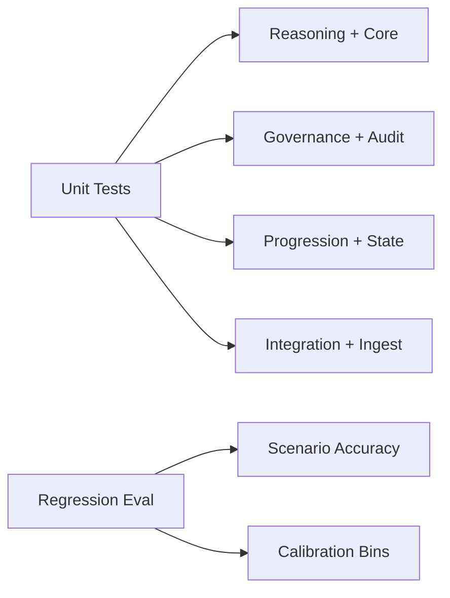
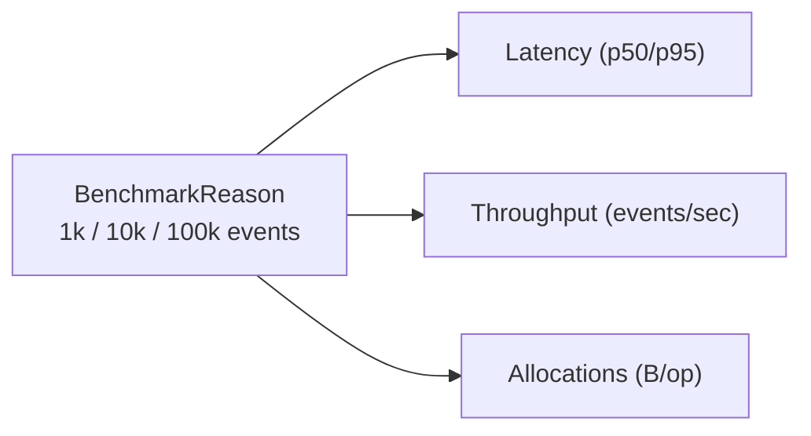
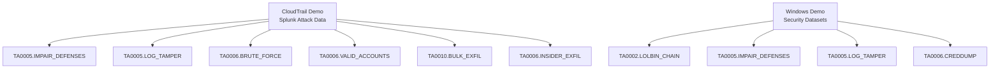
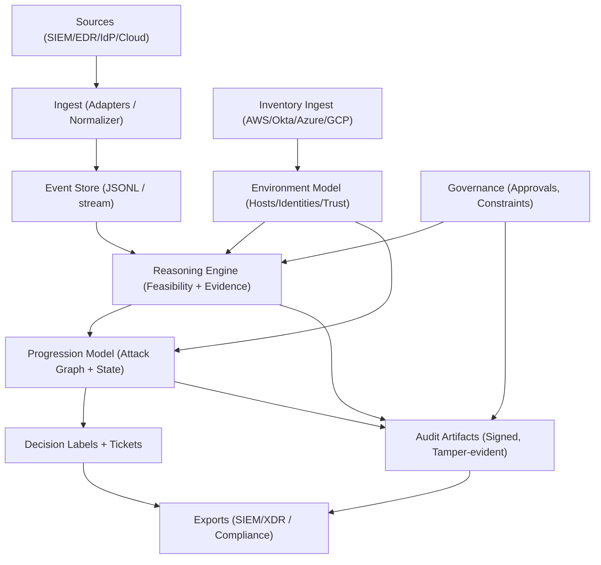
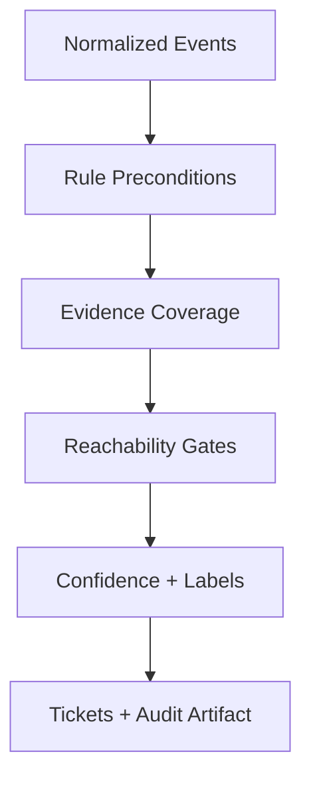

# Aman

License: Apache-2.0

Aman is a human-governed security reasoning system that evaluates causal feasibility, maintains attack progression state, and produces audit-ready, tamper-evident explanations. It sits on top of SIEM/EDR/XDR and AI detections to reduce false positives by eliminating impossible attack paths while preserving human authority and compliance.

## Current Scope (What Exists Today)
- Deterministic causal feasibility engine with explicit preconditions, contradictions, and environment reachability checks.
- Progression state to link related events into threads and attack paths.
- Audit trail with hash chaining and signed artifacts.
- Governance workflow with approvals, dual-approval, and constraints.
- Evidence bundles (`summary.json`, `why_chain.json`, `controls.json`, `oversight.json`, `manifest.json`) plus HTML report for human review.
- Ingest adapters for common schemas (ECS/OCSF/CIM/Splunk/CloudTrail/Okta/MDE/CrowdStrike).

## Pilot Scope (What We Are Testing)
- Audit + governance use case only (no auto-remediation).
- Deterministic decisions with verifiable signatures and tamper detection.
- Dual-control enforced and logged for high-risk decisions.
- Control mappings included in evidence bundles for audit review.
- Self-serve pilot on a single EC2 instance with API + UI + evidence export.

## What It Does
- Determines whether a security event is logically possible in your environment.
- Explains why an alert is real, impossible, or incomplete (not just “high/low risk”).
- Maintains live attack-progression state, not isolated alerts.
- Accepts high-recall AI candidate alerts, then validates each path causally before escalation.
- Explains every decision with a reasoning chain and evidence gaps.
- Produces audit-ready artifacts with hash chaining and signatures.
- Integrates alongside existing SIEM / EDR / XDR systems (no auto-remediation).

## What It Explicitly Does NOT Do
- Does **not** automatically block or remediate threats.
- Does **not** replace SIEM, EDR, or analysts.
- Does **not** allow black-box AI output to bypass causal validation.
- Does **not** silently adapt trust based on attacker behavior.

## Core Concepts
- **Reasoning**: Event feasibility checks using environment and rule preconditions.
- **Progression**: A live attack-progression model that tracks attacker position, confidence, and reachability over time.
- **Audit**: Tamper-evident decision logs and signed artifacts.
- **Audit Bundles**: `controls.json` now includes explicit control mappings plus policy + audit lifecycle metadata.
- **Governance**: Human approvals and constraints that bind reasoning outcomes.
- **Zero-Trust Initialization**: A strict install-time scan that creates a baseline and prevents poisoning.
- **Explanation Layer (Optional)**: Generates a narrative summary and investigation steps from structured reasoning output. This never changes verdicts.
- **ML Assist (Optional, Advisory)**: Suggests missing telemetry, ranks feasible findings (identity + cloud only), and surfaces similar incidents/playbooks. This never changes verdicts.
- **AI Overlay (Optional, High Recall)**: Generates broad candidate alerts first, then routes them through Aman causal filtering (`escalated`, `triaged`, `suppressed`). Default sensitivity profiles are source-aware (`identity`, `cloud`, `edr`) while final escalation remains Aman-governed.

## Docs
- `docs/sample_outputs.md` — example MITRE coverage and reasoning outputs
- `docs/regression_report.md` — evaluate output with accuracy + mismatches
- `docs/vendor_mappings.md` — field-level normalization per vendor
- `docs/mitre_coverage.md` — rule catalog MITRE mapping notes
- `docs/nist_coverage.md` — NIST CSF mapping notes
- `docs/kill_chain_coverage.md` — Cyber Kill Chain mapping notes
- `docs/confidence_bands.md` — confidence band interpretation
- `docs/ci_checklist.md` — CI checklist and local verification steps
- `docs/test_results.md` — latest test runs and regression output
- `docs/full_validation_report.md` — consolidated fresh validation across unit tests, labeled scenario packs, external Splunk-derived data, determinism, and benchmarks
- `docs/release_checklist.md` — release steps and tagging guidance
- `PRIVATE_FEATURES.md` — protected components tracker
- `docs/pilot_demo_pack.md` — pilot-grade demo pack guide
- `docs/metrics_report.md` — synthetic vs public vs pilot metrics summary
- `docs/pilot_metrics_report.md` — candidate->escalated->confirmed and suppression safety metrics
- `docs/integration_onboarding.md` — fast onboarding flow for identity/cloud/EDR integrations
- `docs/noisegraph_integration.md` — vendored noisegraph usage and conversion bridge into Aman
- `docs/pilot_runbook.md` — 2-week pilot execution plan and success gates
- `docs/inventory_schema.md` — file-based inventory ingestion schema
- `docs/architecture.md` — system architecture diagram
- `docs/incident_history.md` — ML-assist history schema and examples
- `docs/known_edge_cases.md` — documented mismatches kept for conservative behavior
- `docs/ui_api_contract.md` — UI API contract (demo)
- `docs/secure_ingest.md` — secure ingest envelope (phase 1)
- `docs/engines.md` — optional external engines (Blackbox Data, Time Travel Forensics)
- `docs/v2_0_experiment.md` — v2.0 positioning and validation-overlay experiment
- `docs/production_benchmark_report.md` — production benchmark snapshot and AI overlay overhead
- `docs/initialization_simulation_policy.md` — controlled initialization, safe attack simulation, approvals, and baseline lifecycle
- `docs/hybrid_saas.md` — hybrid SaaS architecture and deployment notes

---

## Recent Correctness Updates (Batch A)
- **Temporal preconditions** now enforce causal ordering (preconditions must occur before supporting evidence).
- **Credential access** facts are restricted to credential-specific signals (e.g., `lsass_access`, `credential_dumping`).
- **Conditional trust boundaries** are supported via `requires` on `trust_boundaries` and validated on load.
- **Contradictions** expanded for key rules (LOLBin chain, C2, persistence, log tampering).

Example trust boundary with conditions (`env.json`):
```json
{
  "id": "tb-conditional-1",
  "from": "user-net",
  "to": "secure-net",
  "mode": "conditional",
  "requires": ["signin_success", "c2_established"],
  "notes": "Requires active session + C2 before traversal"
}
```

## Test Results (Latest)

Verification run on 2026-03-10:

Commands:
```bash
go test ./...
go run ./cmd/aman evaluate -scenarios data/scenarios_realistic.json -rules data/rules.json -format md -out docs/regression_report.md
go run ./cmd/aman evaluate -scenarios data/scenarios_public.json -rules data/rules.json -format md -out docs/public_dataset_report.md
go run ./cmd/aman system determinism-check -in data/demo_events.json -env data/env.json -rules data/rules.json -out /tmp/determinism_test_latest.json
go run ./cmd/aman system rule-lint -rules data/rules.json -format json > /tmp/rule_lint_latest.json
cd ui && npm run build
```

Summary:
- Full Go test suite passed.
- Determinism check passed: same-order and shuffled-order digests matched.
- Rule lint passed with `0` warnings and `0` legacy fallback rules.
- UI production build passed.
- Benchmarks rerun after the memory-hardening batch.
- External `splunk/attack_data` regression pack scores `95.24%` over `21` labels.
- Focused Windows/cloud/identity blocker packs score `100.00%` on their scoped validation sets.
- Detailed output: `docs/test_results.md`
- Full consolidated validation: `docs/full_validation_report.md`

Regression (realistic suite):
- Accuracy: `0.995` (364 labels)
- Class metrics (Precision/Recall): feasible `1.000/1.000`, incomplete `0.992/1.000`, impossible `1.000/0.750`
- Full report: `docs/regression_report.md`

Public dataset consistency:
- Accuracy: `0.871` (31 labels)
- Class metrics (Precision/Recall): feasible `1.000/0.833`, incomplete `0.800/1.000`, impossible `1.000/0.333`
- Report: `docs/public_dataset_report.md`

Current interpretation:
- Aman is strong on feasible-path precision and conservative on impossible-path claims.
- Remaining public mismatches are mostly blocker-evidence gaps, not obvious engine crashes or unstable behavior.
- Current performance profile is pilot-viable on a modest single node; the main remaining cost center is allocation count, not raw latency.

Pilot dataset impact:
- Pending pilot data (see `docs/metrics_report.md`)

Benchmark snapshot:
- `BenchmarkAssess100k-8`: `308.29 ms/op`, `104.23 MB/op`, `572729 allocs/op`
- `BenchmarkReason100k-8`: `46.35 ms/op`, `21.24 MB/op`, `261111 allocs/op`
- End-to-end `assess` on `100k` generated events: avg `0.52s`, p95 `0.60s`, avg peak RSS `159.3 MB`

---

## SaaS UI (React + TypeScript + Tailwind)

The SaaS UI is a separate frontend app located in `ui/`. It ships as a multi-page analyst console with a guided setup wizard and uses mock data by default.

### Local UI Dev
```bash
cd ui
npm install
npm run dev
```

### Build
```bash
cd ui
npm run build
```

The UI is designed to connect to a dedicated API service in production (SaaS mode). For now it uses static sample data to support demos and UX iteration.

### Local UI API (Demo)
```bash
go run ./cmd/aman serve-api \
  -addr :8081 \
  -report data/report.json \
  -audit data/audit.log \
  -approvals data/approvals.log
```

Set the UI to use the API:
```bash
cd ui
VITE_API_BASE=http://localhost:8081 npm run dev
```

---

## Test Coverage Map


```mermaid
flowchart LR
  A["Unit Tests"] --> B["Reasoning + Core"]
  A --> C["Governance + Audit"]
  A --> D["Progression + State"]
  A --> E["Integration + Ingest"]
  F["Regression Eval"] --> G["Scenario Accuracy"]
  F --> H["Calibration Bins"]
```

---

## Performance Snapshot (Benchmarks)


```mermaid
flowchart LR
  A["BenchmarkReason\n1k / 10k / 100k events"] --> B["Latency (p50/p95)"]
  A --> C["Throughput (events/sec)"]
  A --> D["Allocations (B/op)"]
```

---

## Optional Engines (External Modules)

For scale and forensic replay, Aman can reference **separate engines** that remain external to the core. These are optional and not bundled.

- Blackbox Data Engine: https://github.com/shakeeb1532/blackbox-data
- Time Travel Forensics Engine: https://github.com/shakeeb1532/TimeTravel-Forensics

Details: `docs/engines.md`

---

## Demo Data Coverage (Rules Triggered)


```mermaid
flowchart TD
  A["CloudTrail Demo\nSplunk Attack Data"] --> B["TA0005.IMPAIR_DEFENSES"]
  A --> C["TA0005.LOG_TAMPER"]
  A --> D["TA0006.BRUTE_FORCE"]
  A --> E["TA0006.VALID_ACCOUNTS"]
  A --> F["TA0010.BULK_EXFIL"]
  A --> G["TA0006.INSIDER_EXFIL"]

  H["Windows Demo\nSecurity Datasets"] --> I["TA0002.LOLBIN_CHAIN"]
  H --> J["TA0005.IMPAIR_DEFENSES"]
  H --> K["TA0005.LOG_TAMPER"]
  H --> L["TA0006.CREDDUMP"]
```

---

## Architecture


```mermaid
graph TD
  A["Sources (SIEM/EDR/IdP/Cloud)"] --> B["Ingest (Adapters / Normalizer)"]
  B --> C["Event Store (JSONL / stream)"]
  C --> D["Reasoning Engine (Feasibility + Evidence)"]
  D --> E["Progression Model (Attack Graph + State)"]
  E --> F["Decision Labels + Tickets"]
  D --> G["Audit Artifacts (Signed, Tamper‑evident)"]
  E --> G
  H["Inventory Ingest (AWS/Okta/Azure/GCP)"] --> I["Environment Model (Hosts/Identities/Trust)"]
  I --> D
  I --> E
  J["Governance (Approvals, Constraints)"] --> D
  J --> G
  F --> L["Exports (SIEM/XDR / Compliance)"]
  G --> L
```


## Verification Battery (Reproducible)

Use this exact battery to validate Aman behavior end-to-end:

```bash
cd /Users/shak1532/Downloads/Aegis-R
go test ./...
go test -race ./...
go vet ./...
cd ui && npm run build
```

Audit/governance artifact verification:

```bash
cd /Users/shak1532/Downloads/Aegis-R
go run ./cmd/aman audit verify --audit data/audit.log
go run ./cmd/aman audit package \
  --decision artifact-1770804823227571000 \
  --audit data/audit.log \
  --approvals data/approvals.log \
  --report data/report.json \
  --rules data/rules.json \
  --controls-json \
  --include-why \
  --include-counterfactuals \
  --key data/keypair.json \
  --signer soc-admin \
  --out /tmp/aman-check.evidence.zip
go run ./cmd/aman audit bundle-verify --bundle /tmp/aman-check.evidence.zip
```

Expected outputs:
- `Audit chain: VALID`
- `Digest: VALID`
- `Signature: VALID` (if a signing key is provided)

## Pilot-Focused Capability Snapshot

- Causal verdicting (`POSSIBLE`, `INCOMPLETE`, `CONFLICTED`, `POLICY_IMPOSSIBLE`)
- Human governance with signed approvals and dual-control checks
- Signed `.evidence.zip` package with:
  - `decision.json`
  - `why_chain.json`
  - `counterfactuals.json`
  - `controls.json`
  - `oversight.json`
  - `manifest.json`
- Control mapping export (NIST CSF, SOC 2 CC, ISO 27001)
- Audit chain verification and bundle verification commands

## Audit Package Command (Single Artifact)

```bash
go run ./cmd/aman audit package \
  --decision <decision_id> \
  --audit data/audit.log \
  --approvals data/approvals.log \
  --report data/report.json \
  --rules data/rules.json \
  --controls-json \
  --include-why \
  --include-counterfactuals \
  --key data/keypair.json \
  --signer soc-admin \
  --out data/evidence_inspect/<decision_id>.evidence.zip
```

## Quick Start

### 1) Install Go
```bash
brew install go
```

### 2) Initialize Zero-Trust Baseline (Required)
```bash
go run ./cmd/aman init-scan \
  -baseline data/zero_trust_baseline.json \
  -out init_scan_report.json
```

### 3) Generate Synthetic Events
```bash
go run ./cmd/aman generate -out events.json -count 80
```

### 4) Run Reasoning (CLI)
```bash
go run ./cmd/aman reason -in events.json -rules data/rules.json -format cli
```

Add an explanation layer (optional, does not change verdicts):
```bash
go run ./cmd/aman reason -in events.json -rules data/rules.json -format cli \
  --explain --explain-ack I_ACKNOWLEDGE_LLM_RISK
```

Add ML assist (optional, advisory):
```bash
go run ./cmd/aman reason -in events.json -rules data/rules.json -format cli \
  --ml-assist \
  --ml-history data/incident_history.json
```

### 5) Run Full Assessment (JSON)
```bash
go run ./cmd/aman assess \
  -in events.json \
  -env data/env.json \
  -state state.json \
  -audit audit.log \
  -policy data/policy.json \
  -config data/ops.json \
  -baseline data/zero_trust_baseline.json \
  -format json

Write a compressed report:
```bash
go run ./cmd/aman assess \
  -in events.json \
  -env data/env.json \
  -state state.json \
  -audit audit.log \
  -baseline data/zero_trust_baseline.json \
  -format json \
  -out report.json.lz4
```
```

### Optional: Compressed State Snapshots
If the state path ends with `.lz4`, Aman will compress/decompress snapshots using LZ4 (requires a C compiler/CGO).
```bash
go run ./cmd/aman assess \
  -in events.json \
  -env data/env.json \
  -state state.json.lz4 \
  -audit audit.log \
  -format json
```

Add an explanation layer (optional, does not change verdicts):
```bash
go run ./cmd/aman assess \
  -in events.json \
  -env data/env.json \
  -state state.json \
  -audit audit.log \
  -baseline data/zero_trust_baseline.json \
  -format json \
  --explain --explain-ack I_ACKNOWLEDGE_LLM_RISK
```

Add ML assist (optional, advisory):
```bash
go run ./cmd/aman assess \
  -in events.json \
  -env data/env.json \
  -state state.json \
  -audit audit.log \
  -baseline data/zero_trust_baseline.json \
  -format json \
  --ml-assist \
  --ml-history data/incident_history.json
```

---

## One Command Local Demo

Run a full local demo (sample ingest + report generated):
```bash
make demo
```

Or run with Docker Compose:
```bash
docker compose up --build
```

---

## Zero-Trust Initialization (Poison Resistance)

Aman requires a **strict initialization scan** on first install. The baseline is immutable unless an **admin** explicitly overrides.

### v2.0 Initialization and Tuning Model
- Use controlled initialization validation first, not offensive exploitation by default.
- Build a safe baseline from configuration, identity, network, and telemetry checks.
- Run optional safe attack simulation only as approval-gated, non-destructive emulation (staging by default; tightly scoped production windows only when approved).
- Require human approval for high-risk simulation scope, timing, and methods.
- Treat baseline as versioned and immutable per release, with signed updates and explicit drift/change history.
- Tune continuously after initialization using analyst feedback and incident outcomes rather than one-time setup.

### Run Init Scan
```bash
go run ./cmd/aman init-scan \
  -baseline data/zero_trust_baseline.json \
  -out init_scan_report.json
```

### Fast Baseline Check (Assess Only)
- `assess` only checks baseline integrity.
- If baseline is missing, `assess` **refuses to run** and instructs the installer to run `init-scan`.

### Override Policy
- Overrides require a **signed admin approval**.
- Aman will display **explicit warnings** and a liability waiver if a baseline issue is overridden.

---

## CLI Commands

### Core
- `generate` — generate synthetic events
- `reason` — feasibility reasoning only
- `assess` — reasoning + progression + audit artifacts + integration hooks

### Governance
- `keys` — generate keypair
- `approve` — create approval (single)
- `approve2` — create dual approval
- `verify` — verify approval
- `profile-add` — add analyst reasoning profile
- `constraint-add` — add reasoning constraint
- `disagreement-add` — record analyst disagreement
- `govern ticket list|show|close` — ticket workflow over reasoning threads

### Audit
- `audit-verify` — verify hash chain
- `audit-sign` — sign audit artifacts

Audit logs are JSONL by default. To enable compression, use a `.lz4` audit path and export when needed:
```bash
go run ./cmd/aman assess \
  -in events.json \
  -env data/env.json \
  -state state.json \
  -audit audit.log.lz4 \
  -format json

go run ./cmd/aman audit export -audit audit.log.lz4 -out audit.log
```

SIEM export supports `.lz4`:
```bash
go run ./cmd/aman assess \
  -in events.json \
  -env data/env.json \
  -state state.json \
  -audit audit.log \
  -siem siem.json.lz4 \
  -format json
```

Report output supports `.lz4` via `-out`:
```bash
go run ./cmd/aman assess \
  -in events.json \
  -env data/env.json \
  -state state.json \
  -audit audit.log \
  -format json \
  -out report.json.lz4
```

### Evaluation
- `generate-scenarios` — build synthetic labeled scenarios
- `evaluate` — evaluate accuracy on scenarios

### System
- `system status` — baseline + profile status
- `system health` — component health summary
- `system coverage` — MITRE coverage report (rules -> tactics/techniques)
- `system coverage -env data/env.json` — environment-scoped coverage
- `system confidence -report report.json` — confidence band report
- `system coverage -out docs/coverage_env.md` — save coverage as Markdown
- `system confidence -out docs/confidence_report.md` — save confidence bands as Markdown

### Integration
- `ingest-http` — HTTP ingest endpoint (supports secure envelope)
- `ingest-inventory` — build `env.json` from inventory exports
- `inventory-drift` — compare inventory build to baseline env.json
- `inventory-refresh` — refresh env + drift report (file or live adapters)
- `inventory-schedule` — refresh env on a randomized cadence

Secure ingest (phase 1, DCF-inspired):
```bash
# Quickstart (keyring + secure HTTP ingest)
go run ./cmd/aman ingest secure-init -out data/ingest_keys.json
go run ./cmd/aman ingest http -addr :8080 -secure-keyring data/ingest_keys.json

# Pack events into a secure envelope
go run ./cmd/aman ingest secure-pack \
  -in events.json \
  -out events.aman \
  -keyring data/ingest_keys.json \
  -compress auto \
  -policy adaptive \
  -risk medium

# Send securely
curl -X POST "http://localhost:8080/ingest-secure?schema=native" --data-binary @events.aman

# Unpack and verify (offline)
go run ./cmd/aman ingest secure-unpack \
  -in events.aman \
  -out events.json \
  -keyring data/ingest_keys.json

# Rotate keys (keeps previous for transition)
go run ./cmd/aman ingest secure-rotate -in data/ingest_keys.json
```
`/ingest-health` reports HMAC/decrypt/schema failure rates for the secure pipeline.

### Rule Expansion Packs
You can keep the pilot rules stable and load optional expansion packs.
```bash
go run ./cmd/aman assess \
  -in events.json \
  -env data/env.json \
  -state data/state.json \
  -audit data/audit.log \
  -rules data/rules.json \
  -rules-extra data/rules_expansion.json
```

### Zero-Trust
- `init-scan` — strict install-time baseline creation
- `scan` — compare current system to baseline

---

## Governance & Approval Flow

### Generate Keys
```bash
go run ./cmd/aman keys -out keypair.json
```

### Approve (Single)
```bash
go run ./cmd/aman approve \
  -key keypair.json \
  -id change-1 \
  -ttl 10m \
  -okta true \
  -signer alice \
  -role approver \
  -out approval.json
```

### Approve (Template)
```bash
go run ./cmd/aman govern templates

go run ./cmd/aman govern approve \
  --item change-1 \
  --template safe_change \
  --key keypair.json \
  --signer alice \
  --log data/approvals.log
```

### Approve (Dual)
```bash
go run ./cmd/aman approve2 \
  -key1 keypair.json \
  -key2 keypair.json \
  -id change-1 \
  -ttl 10m \
  -okta true \
  -signer1 alice \
  -signer2 bob \
  -out dual_approval.json
```

---

## Identity Wedge Pilot (Entra Graph)
```bash
aman pilot identity-entra \
  --start 2026-02-27T06:00:00Z \
  --end 2026-02-27T06:15:00Z \
  --outdir out/pilot/entra \
  --rules data/rules_identity_wedge.json
```

## Integration Schemas

Supported `schema` values for ingestion:
- `ecs`
- `elastic_ecs`
- `ocsf`
- `cim`
- `splunk_cim_auth`
- `splunk_cim_net`
- `mde` (`kind=device|identity`)
- `okta_systemlog`
- `aws_cloudtrail`
- `sentinel_csl`
- `crowdstrike_fdr`
- `entra_signins_graph`

Example:
```bash
curl -X POST "http://localhost:8080/ingest?schema=ecs" -d @data/fixtures/ecs/sample.json
```

---

## State Ingestion (Inventory + Topology + IAM)

Build the environment model directly from file-based inventory exports:

```bash
go run ./cmd/aman ingest-inventory -in data/inventory -out data/env.json
```

See `docs/inventory_schema.md` for the JSON schema per provider.
Topology depth now includes routes, peerings, and internet egress paths (AWS/Azure/GCP).

Live adapters (API-ready, requires credentials):

```bash
go run ./cmd/aman inventory-adapter -provider aws -config data/inventory/config.json -out data/env.json
```

AWS, Okta, Azure, and GCP adapters support live ingestion using standard credentials (AWS chain, Okta token, Azure client credentials, GCP ADC or service account). Use `inventory-refresh` for one-shot refresh + drift, or `inventory-schedule` for continuous refreshes.

Randomized scheduling to avoid fixed cadence targeting:

```bash
go run ./cmd/aman inventory-schedule \\
  -provider all \\
  -config data/inventory/config.json \\
  -base data/env.json \\
  -out data/env.json \\
  -drift drift.json \\
  -interval 6h \\
  -jitter 30m
```

One-shot refresh + drift report:

```bash
go run ./cmd/aman inventory-refresh \\
  -provider all \\
  -config data/inventory/config.json \\
  -base data/env.json \\
  -out data/env.json \\
  -drift drift.json \\
  -require-approval
```

Vendor field normalization details are in:
- `docs/vendor_mappings.md`
Fixture coverage lives under `data/fixtures/` and is exercised by mapping tests.

---

## Normalized Envelope (Internal Model)

Aman adapters normalize events into a stable envelope:
- `timestamp`
- `source` (EDR/IdP/CloudTrail/etc.)
- `principal` (identity)
- `asset` (host/resource)
- `action` (normalized verb)
- `evidence` (raw refs)
- `confidence` (scoring)
- `tags` (zone, criticality)

Confidence is **heuristic and rule-based**, not calibrated ML. Outputs explicitly label the confidence model.

Decision labels: `suppress` / `deprioritize` / `keep` / `escalate` are layered on top of feasibility verdicts.
Local decision cache scope: host + principal + rule with a 24h TTL.
Threads are clustered by host + principal within a 2h window.
Thread formation includes a confidence score and reason for why clustering did or didn’t occur.

Synthetic thread suite:
- `data/synthetic_threads.json` (multi-entity events that yield 2–3 threads)

Baseline validation report:
- `docs/BASELINE_REPORT.md`
- `docs/BASELINE_REPORT.pdf`

---

## Attack Progression Model

Aman maintains a live **attack progression graph** with:
- Graph-based current attacker position overlay
- Confidence decay over time
- Time-windowed progression (default last 24h)

Minimal trigger set covers most real intrusions:
- Identity and Auth events
- Privilege escalation and role changes
- Suspicious host execution and credential access
- Lateral movement and inbound admin protocols
- Exfil and impact indicators

---

## Evaluation Harness

Generate scenarios:
```bash
go run ./cmd/aman generate-scenarios -out data/scenarios.json -rules data/rules.json
```

Evaluate:
```bash
go run ./cmd/aman evaluate -scenarios data/scenarios.json -rules data/rules.json -format cli
```

Realistic scenarios:
```bash
go run ./cmd/aman evaluate -scenarios data/scenarios_realistic.json -rules data/rules.json -format cli
```

---

## Benchmarks

Reasoning:
```bash
go test ./internal/logic -bench BenchmarkReason -benchmem
```

Assessment:
```bash
go test ./internal/core -bench BenchmarkAssess -benchmem
```

---

## Audit Artifacts

- `audit.log` is **hash chained**
- `audit-sign` produces **signed audit logs**

```bash
go run ./cmd/aman audit-sign -audit audit.log -out signed_audit.log -signer soc-admin
```

---

## Configuration

`data/ops.json` controls logging, metrics, and strictness:
```json
{
  "log_level": "info",
  "metrics_on": true,
  "strict_mode": false
}
```

- `strict_mode=false` reduces memory by omitting full supporting event objects.

---

## Kubernetes Deployment (Helm)

### Requirements
1. Kubernetes 1.27+
2. Ingress controller (nginx default, ALB optional)
3. cert-manager for TLS (or provide a secret)

### Install
```bash
kubectl create namespace aman
helm install aman ./charts/aman --namespace aman
```

### Configure Signing Keys
```bash
kubectl -n aman create secret generic aman-signing-keys --from-file=keypair.json
```

### Example Values Overrides
```bash
helm upgrade --install aman ./charts/aman \
  --namespace aman \
  --set ingress.host=aman.example.com \
  --set ingress.tls.secretName=aman-tls \
  --set signingKeySecret.create=false \
  --set signingKeySecret.name=aman-signing-keys
```

---

## Docker

```bash
docker build -t aman .
docker run -p 8080:8080 aman
```

---

## Release Artifacts

- Container images: `ghcr.io/shakeeb1532/aman:<tag>` and `latest`
- Versioned binaries via GoReleaser (tagged releases)

---

## Repository Structure
- `cmd/aman/` — CLI entrypoint
- `internal/logic/` — reasoning engine
- `internal/core/` — stateful assessment
- `internal/progression/` — attack progression model
- `internal/audit/` — audit chain + signing
- `internal/governance/` — policy + roles
- `internal/integration/` — adapters + ingest
- `internal/eval/` — evaluation harness
- `data/` — sample rules/env/scenarios/fixtures
- `docs/` — vendor mapping documentation
- `docs/mitre_coverage.md` — MITRE coverage reporting usage

---

## Pilot Demo Results (Public Data)

CloudTrail demo (Splunk Attack Data):
- Events ingested: 5,883
- Evidence-backed rules: `TA0005.IMPAIR_DEFENSES`, `TA0005.LOG_TAMPER`, `TA0006.BRUTE_FORCE`, `TA0006.VALID_ACCOUNTS`, `TA0010.BULK_EXFIL`, `TA0006.INSIDER_EXFIL`
- Outputs: `data/fixtures/splunk_attack_data/assessment_clean.json`, `data/fixtures/splunk_attack_data/audit.log`, `data/fixtures/splunk_attack_data/siem.json`

Windows demo (Security Datasets):
- Events ingested: 9
- Evidence-backed rules: `TA0002.LOLBIN_CHAIN`, `TA0005.IMPAIR_DEFENSES`, `TA0005.LOG_TAMPER`, `TA0006.CREDDUMP`
- Outputs: `data/fixtures/securitydatasets/assessment_clean.json`, `data/fixtures/securitydatasets/audit.log`, `data/fixtures/securitydatasets/siem.json`

See `docs/pilot_demo_pack.md` for the full demo walkthrough.

---

## Reasoning Flow


```mermaid
flowchart TD
  A["Normalized Events"] --> B["Rule Preconditions"]
  B --> C["Evidence Coverage"]
  C --> D["Reachability Gates"]
  D --> E["Confidence + Labels"]
  E --> F["Tickets + Audit Artifact"]
```

---

## Roadmap (Suggested)
- Production auth (OIDC / SSO integration)
- Vendor-specific adapter expansion (more fields, more products)
- Rule catalog growth (full MITRE coverage)
- Hardened production packaging (Helm refinement, systemd)

---

## License
Apache-2.0
