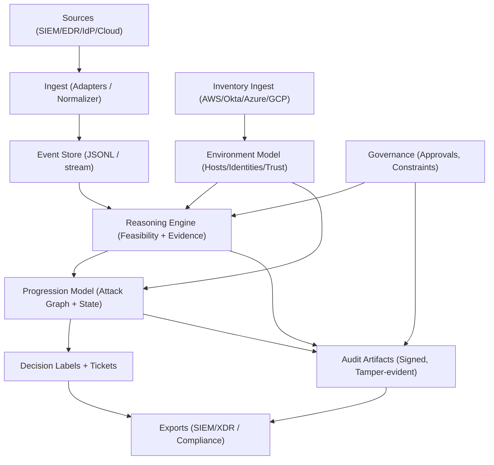

# Aegis-R

License: Apache-2.0

Aegis-R is a human-governed security reasoning system that evaluates causal feasibility, maintains attack progression state, and produces audit-ready, tamper-evident explanations. It focuses on reducing false positives by eliminating impossible attack paths while preserving human authority and compliance.

## What It Does
- Determines whether a security event is logically possible in your environment.
- Explains why an alert is real, impossible, or incomplete (not just “high/low risk”).
- Maintains live attack-progression state, not isolated alerts.
- Explains every decision with a reasoning chain and evidence gaps.
- Produces audit-ready artifacts with hash chaining and signatures.
- Integrates alongside existing SIEM / EDR / XDR systems (no auto-remediation).

## What It Explicitly Does NOT Do
- Does **not** automatically block or remediate threats.
- Does **not** replace SIEM, EDR, or analysts.
- Does **not** rely on black-box AI decisions.
- Does **not** silently adapt trust based on attacker behavior.

## Core Concepts
- **Reasoning**: Event feasibility checks using environment and rule preconditions.
- **Progression**: A live attack-progression model that tracks attacker position, confidence, and reachability over time.
- **Audit**: Tamper-evident decision logs and signed artifacts.
- **Governance**: Human approvals and constraints that bind reasoning outcomes.
- **Zero-Trust Initialization**: A strict install-time scan that creates a baseline and prevents poisoning.
- **Explanation Layer (Optional)**: Generates a narrative summary and investigation steps from structured reasoning output. This never changes verdicts.
- **ML Assist (Optional, Advisory)**: Suggests missing telemetry, ranks feasible findings (identity + cloud only), and surfaces similar incidents/playbooks. This never changes verdicts.

## Docs
- `docs/sample_outputs.md` — example MITRE coverage and reasoning outputs
- `docs/regression_report.md` — evaluate output with accuracy + mismatches
- `docs/vendor_mappings.md` — field-level normalization per vendor
- `docs/mitre_coverage.md` — rule catalog MITRE mapping notes
- `docs/nist_coverage.md` — NIST CSF mapping notes
- `docs/kill_chain_coverage.md` — Cyber Kill Chain mapping notes
- `docs/confidence_bands.md` — confidence band interpretation
- `docs/ci_checklist.md` — CI checklist and local verification steps
- `docs/test_results.md` — latest test runs and regression output
- `docs/release_checklist.md` — release steps and tagging guidance
- `PRIVATE_FEATURES.md` — protected components tracker
- `docs/pilot_demo_pack.md` — pilot-grade demo pack guide
- `docs/metrics_report.md` — synthetic vs public vs pilot metrics summary
- `docs/inventory_schema.md` — file-based inventory ingestion schema
- `docs/architecture.md` — system architecture diagram
- `docs/incident_history.md` — ML-assist history schema and examples
- `docs/known_edge_cases.md` — documented mismatches kept for conservative behavior

---

## Test Results (Latest)

Command:
```bash
go test ./...
```

Summary:
- All packages passed.
- Detailed output: `docs/test_results.md`

Regression (latest run on synthetic scenarios):
- Accuracy: 0.953 (Total labels: 127)
- Class metrics (Precision/Recall): feasible 0.970/1.000, incomplete 1.000/0.884, impossible 0.826/0.950
- Full report + calibration: `docs/regression_report.md`

Public dataset consistency:
- Accuracy: 0.941 (Total labels: 17)
- Report: `docs/public_dataset_report.md`

Performance snapshot (Apple M1):
- Assess 1k: 1.67 ms/op, 1.50 MB/op, 4,696 allocs/op
- Assess 10k: 13.1 ms/op, 12.4 MB/op, 37,233 allocs/op
- Assess 100k: 141.8 ms/op, 189 MB/op, 361,568 allocs/op
- Reason 1k: 0.124 ms/op, 0.55 MB/op, 623 allocs/op
- Reason 10k: 2.08 ms/op, 6.0 MB/op, 688 allocs/op
- Reason 100k: 15.3 ms/op, 74 MB/op, 814 allocs/op

Pilot dataset impact:
- Pending pilot data (see `docs/metrics_report.md`)

---

## Test Coverage Map


---

## Performance Snapshot (Benchmarks)


---

## Demo Data Coverage (Rules Triggered)


---

## Architecture



## Quick Start

### 1) Install Go
```bash
brew install go
```

### 2) Initialize Zero-Trust Baseline (Required)
```bash
go run ./cmd/aegisr init-scan \
  -baseline data/zero_trust_baseline.json \
  -out init_scan_report.json
```

### 3) Generate Synthetic Events
```bash
go run ./cmd/aegisr generate -out events.json -count 80
```

### 4) Run Reasoning (CLI)
```bash
go run ./cmd/aegisr reason -in events.json -rules data/rules.json -format cli
```

Add an explanation layer (optional, does not change verdicts):
```bash
go run ./cmd/aegisr reason -in events.json -rules data/rules.json -format cli --explain
```

Add ML assist (optional, advisory):
```bash
go run ./cmd/aegisr reason -in events.json -rules data/rules.json -format cli \
  --ml-assist \
  --ml-history data/incident_history.json
```

### 5) Run Full Assessment (JSON)
```bash
go run ./cmd/aegisr assess \
  -in events.json \
  -env data/env.json \
  -state state.json \
  -audit audit.log \
  -policy data/policy.json \
  -config data/ops.json \
  -baseline data/zero_trust_baseline.json \
  -format json
```

Add an explanation layer (optional, does not change verdicts):
```bash
go run ./cmd/aegisr assess \
  -in events.json \
  -env data/env.json \
  -state state.json \
  -audit audit.log \
  -baseline data/zero_trust_baseline.json \
  -format json \
  --explain
```

Add ML assist (optional, advisory):
```bash
go run ./cmd/aegisr assess \
  -in events.json \
  -env data/env.json \
  -state state.json \
  -audit audit.log \
  -baseline data/zero_trust_baseline.json \
  -format json \
  --ml-assist \
  --ml-history data/incident_history.json
```

---

## One Command Local Demo

Run a full local demo (sample ingest + report generated):
```bash
make demo
```

Or run with Docker Compose:
```bash
docker compose up --build
```

---

## Zero-Trust Initialization (Poison Resistance)

Aegis-R requires a **strict initialization scan** on first install. The baseline is immutable unless an **admin** explicitly overrides.

### Run Init Scan
```bash
go run ./cmd/aegisr init-scan \
  -baseline data/zero_trust_baseline.json \
  -out init_scan_report.json
```

### Fast Baseline Check (Assess Only)
- `assess` only checks baseline integrity.
- If baseline is missing, `assess` **refuses to run** and instructs the installer to run `init-scan`.

### Override Policy
- Overrides require a **signed admin approval**.
- Aegis-R will display **explicit warnings** and a liability waiver if a baseline issue is overridden.

---

## CLI Commands

### Core
- `generate` — generate synthetic events
- `reason` — feasibility reasoning only
- `assess` — reasoning + progression + audit artifacts + integration hooks

### Governance
- `keys` — generate keypair
- `approve` — create approval (single)
- `approve2` — create dual approval
- `verify` — verify approval
- `profile-add` — add analyst reasoning profile
- `constraint-add` — add reasoning constraint
- `disagreement-add` — record analyst disagreement
- `govern ticket list|show|close` — ticket workflow over reasoning threads

### Audit
- `audit-verify` — verify hash chain
- `audit-sign` — sign audit artifacts

### Evaluation
- `generate-scenarios` — build synthetic labeled scenarios
- `evaluate` — evaluate accuracy on scenarios

### System
- `system status` — baseline + profile status
- `system health` — component health summary
- `system coverage` — MITRE coverage report (rules -> tactics/techniques)
- `system coverage -env data/env.json` — environment-scoped coverage
- `system confidence -report report.json` — confidence band report
- `system coverage -out docs/coverage_env.md` — save coverage as Markdown
- `system confidence -out docs/confidence_report.md` — save confidence bands as Markdown

### Integration
- `ingest-http` — HTTP ingest endpoint
- `ingest-inventory` — build `env.json` from inventory exports
- `inventory-drift` — compare inventory build to baseline env.json
- `inventory-refresh` — refresh env + drift report (file or live adapters)
- `inventory-schedule` — refresh env on a randomized cadence

### Zero-Trust
- `init-scan` — strict install-time baseline creation
- `scan` — compare current system to baseline

---

## Governance & Approval Flow

### Generate Keys
```bash
go run ./cmd/aegisr keys -out keypair.json
```

### Approve (Single)
```bash
go run ./cmd/aegisr approve \
  -key keypair.json \
  -id change-1 \
  -ttl 10m \
  -okta true \
  -signer alice \
  -role approver \
  -out approval.json
```

### Approve (Dual)
```bash
go run ./cmd/aegisr approve2 \
  -key1 keypair.json \
  -key2 keypair.json \
  -id change-1 \
  -ttl 10m \
  -okta true \
  -signer1 alice \
  -signer2 bob \
  -out dual_approval.json
```

---

## Integration Schemas

Supported `schema` values for ingestion:
- `ecs`
- `elastic_ecs`
- `ocsf`
- `cim`
- `splunk_cim_auth`
- `splunk_cim_net`
- `mde` (`kind=device|identity`)
- `okta_systemlog`
- `aws_cloudtrail`
- `sentinel_csl`
- `crowdstrike_fdr`

Example:
```bash
curl -X POST "http://localhost:8080/ingest?schema=ecs" -d @data/fixtures/ecs/sample.json
```

---

## State Ingestion (Inventory + Topology + IAM)

Build the environment model directly from file-based inventory exports:

```bash
go run ./cmd/aegisr ingest-inventory -in data/inventory -out data/env.json
```

See `docs/inventory_schema.md` for the JSON schema per provider.
Topology depth now includes routes, peerings, and internet egress paths (AWS/Azure/GCP).

Live adapters (API-ready, requires credentials):

```bash
go run ./cmd/aegisr inventory-adapter -provider aws -config data/inventory/config.json -out data/env.json
```

AWS, Okta, Azure, and GCP adapters support live ingestion using standard credentials (AWS chain, Okta token, Azure client credentials, GCP ADC or service account). Use `inventory-refresh` for one-shot refresh + drift, or `inventory-schedule` for continuous refreshes.

Randomized scheduling to avoid fixed cadence targeting:

```bash
go run ./cmd/aegisr inventory-schedule \\
  -provider all \\
  -config data/inventory/config.json \\
  -base data/env.json \\
  -out data/env.json \\
  -drift drift.json \\
  -interval 6h \\
  -jitter 30m
```

One-shot refresh + drift report:

```bash
go run ./cmd/aegisr inventory-refresh \\
  -provider all \\
  -config data/inventory/config.json \\
  -base data/env.json \\
  -out data/env.json \\
  -drift drift.json \\
  -require-approval
```

Vendor field normalization details are in:
- `docs/vendor_mappings.md`
Fixture coverage lives under `data/fixtures/` and is exercised by mapping tests.

---

## Normalized Envelope (Internal Model)

Aegis-R adapters normalize events into a stable envelope:
- `timestamp`
- `source` (EDR/IdP/CloudTrail/etc.)
- `principal` (identity)
- `asset` (host/resource)
- `action` (normalized verb)
- `evidence` (raw refs)
- `confidence` (scoring)
- `tags` (zone, criticality)

Confidence is **heuristic and rule-based**, not calibrated ML. Outputs explicitly label the confidence model.

Decision labels: `suppress` / `deprioritize` / `keep` / `escalate` are layered on top of feasibility verdicts.
Local decision cache scope: host + principal + rule with a 24h TTL.
Threads are clustered by host + principal within a 2h window.
Thread formation includes a confidence score and reason for why clustering did or didn’t occur.

Synthetic thread suite:
- `data/synthetic_threads.json` (multi-entity events that yield 2–3 threads)

Baseline validation report:
- `docs/BASELINE_REPORT.md`
- `docs/BASELINE_REPORT.pdf`

---

## Attack Progression Model

Aegis-R maintains a live **attack progression graph** with:
- Graph-based current attacker position overlay
- Confidence decay over time
- Time-windowed progression (default last 24h)

Minimal trigger set covers most real intrusions:
- Identity and Auth events
- Privilege escalation and role changes
- Suspicious host execution and credential access
- Lateral movement and inbound admin protocols
- Exfil and impact indicators

---

## Evaluation Harness

Generate scenarios:
```bash
go run ./cmd/aegisr generate-scenarios -out data/scenarios.json -rules data/rules.json
```

Evaluate:
```bash
go run ./cmd/aegisr evaluate -scenarios data/scenarios.json -rules data/rules.json -format cli
```

Realistic scenarios:
```bash
go run ./cmd/aegisr evaluate -scenarios data/scenarios_realistic.json -rules data/rules.json -format cli
```

---

## Benchmarks

Reasoning:
```bash
go test ./internal/logic -bench BenchmarkReason -benchmem
```

Assessment:
```bash
go test ./internal/core -bench BenchmarkAssess -benchmem
```

---

## Audit Artifacts

- `audit.log` is **hash chained**
- `audit-sign` produces **signed audit logs**

```bash
go run ./cmd/aegisr audit-sign -audit audit.log -out signed_audit.log -signer soc-admin
```

---

## Configuration

`data/ops.json` controls logging, metrics, and strictness:
```json
{
  "log_level": "info",
  "metrics_on": true,
  "strict_mode": false
}
```

- `strict_mode=false` reduces memory by omitting full supporting event objects.

---

## Kubernetes Deployment (Helm)

### Requirements
1. Kubernetes 1.27+
2. Ingress controller (nginx default, ALB optional)
3. cert-manager for TLS (or provide a secret)

### Install
```bash
kubectl create namespace aegis-r
helm install aegis-r ./charts/aegis-r --namespace aegis-r
```

### Configure Signing Keys
```bash
kubectl -n aegis-r create secret generic aegisr-signing-keys --from-file=keypair.json
```

### Example Values Overrides
```bash
helm upgrade --install aegis-r ./charts/aegis-r \
  --namespace aegis-r \
  --set ingress.host=aegisr.example.com \
  --set ingress.tls.secretName=aegisr-tls \
  --set signingKeySecret.create=false \
  --set signingKeySecret.name=aegisr-signing-keys
```

---

## Docker

```bash
docker build -t aegisr .
docker run -p 8080:8080 aegisr
```

---

## Release Artifacts

- Container images: `ghcr.io/shakeeb1532/aegis-r:<tag>` and `latest`
- Versioned binaries via GoReleaser (tagged releases)

---

## Repository Structure
- `cmd/aegisr/` — CLI entrypoint
- `internal/logic/` — reasoning engine
- `internal/core/` — stateful assessment
- `internal/progression/` — attack progression model
- `internal/audit/` — audit chain + signing
- `internal/governance/` — policy + roles
- `internal/integration/` — adapters + ingest
- `internal/eval/` — evaluation harness
- `data/` — sample rules/env/scenarios/fixtures
- `docs/` — vendor mapping documentation
- `docs/mitre_coverage.md` — MITRE coverage reporting usage

---

## Pilot Demo Results (Public Data)

CloudTrail demo (Splunk Attack Data):
- Events ingested: 5,883
- Evidence-backed rules: `TA0005.IMPAIR_DEFENSES`, `TA0005.LOG_TAMPER`, `TA0006.BRUTE_FORCE`, `TA0006.VALID_ACCOUNTS`, `TA0010.BULK_EXFIL`, `TA0006.INSIDER_EXFIL`
- Outputs: `data/fixtures/splunk_attack_data/assessment_clean.json`, `data/fixtures/splunk_attack_data/audit.log`, `data/fixtures/splunk_attack_data/siem.json`

Windows demo (Security Datasets):
- Events ingested: 9
- Evidence-backed rules: `TA0002.LOLBIN_CHAIN`, `TA0005.IMPAIR_DEFENSES`, `TA0005.LOG_TAMPER`, `TA0006.CREDDUMP`
- Outputs: `data/fixtures/securitydatasets/assessment_clean.json`, `data/fixtures/securitydatasets/audit.log`, `data/fixtures/securitydatasets/siem.json`

See `docs/pilot_demo_pack.md` for the full demo walkthrough.

---

## Reasoning Flow


---

## Roadmap (Suggested)
- Production auth (OIDC / SSO integration)
- Vendor-specific adapter expansion (more fields, more products)
- Rule catalog growth (full MITRE coverage)
- Hardened production packaging (Helm refinement, systemd)

---

## License
Apache-2.0
