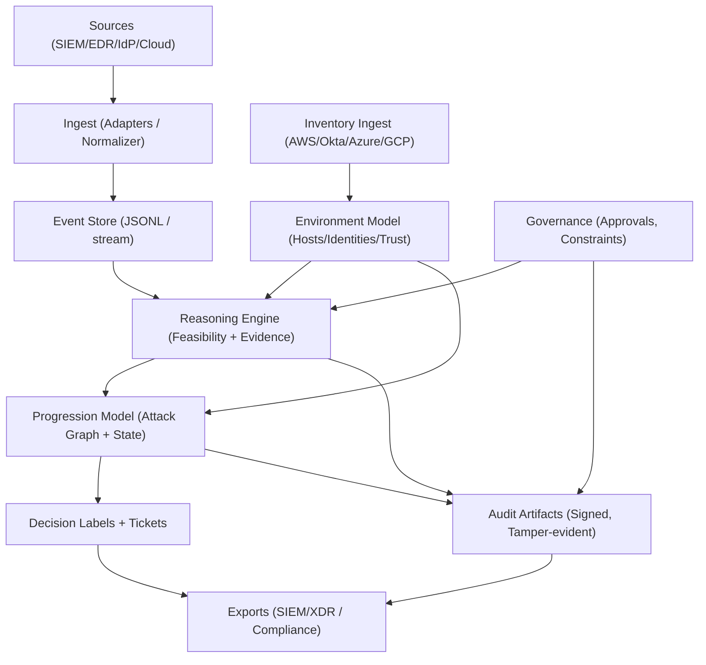

# Architecture

```mermaid
graph TD
  A["Sources (SIEM/EDR/IdP/Cloud)"] --> B["Ingest (Adapters / Normalizer)"]
  B --> C["Event Store (JSONL / stream)"]
  C --> D["Reasoning Engine (Feasibility + Evidence)" ]
  D --> E["Progression Model (Attack Graph + State)"]
  E --> F["Decision Labels + Tickets"]
  D --> G["Audit Artifacts (Signed, Tamper‑evident)"]
  E --> G
  H["Inventory Ingest (AWS/Okta/Azure/GCP)"] --> I["Environment Model (Hosts/Identities/Trust)"]
  I --> D
  I --> E
  J["Governance (Approvals, Constraints)"] --> D
  J --> G
  F --> L["Exports (SIEM/XDR / Compliance)"]
  G --> L
```
