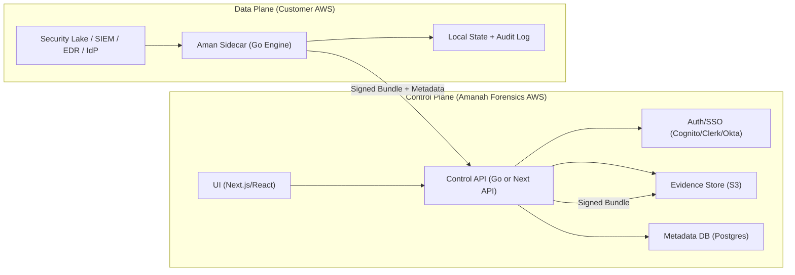

# Hybrid SaaS Architecture (Control Plane + Customer Data Plane)

## Goal
Run Aman as a hybrid SaaS so customer data stays in their account while Amanah Forensics hosts the UI and control plane.

## Diagram

## Responsibilities
### Control Plane
- Hosts UI + API
- Handles tenants, auth, and approvals
- Stores evidence bundles and metadata
- Does not ingest raw logs

### Data Plane
- Runs Aman engine inside customer account
- Pulls from local log sources
- Generates signed bundles + control mappings
- Sends bundles to control plane

## Minimum Security Requirements
- Cross-account IAM role with least privilege
- Signed evidence bundles + verification
- Tamper-evident audit log
- Dual approvals for high-risk decisions

## Deployment Phases
1. Pilot single tenant (one control plane, one sidecar).
2. Add multi-tenancy + SSO.
3. Add audit bundle lifecycle tracking and retention policy.

## Related Files
- `deploy/hybrid/README.md`
- `deploy/hybrid/control-plane/README.md`
- `deploy/hybrid/data-plane/README.md`
