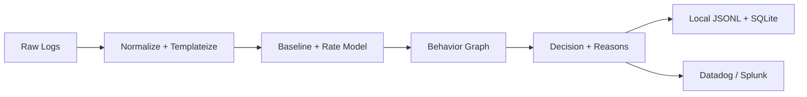

# noisegraph

Noisegraph is a **local-first log shipper + SOC memory engine** that learns normal behavior, builds a lightweight behavioral graph, and turns raw logs into **noise-reduced decisions** you can trust.

It runs on a laptop or small VM, stores state in SQLite, and forwards only the decisions you want into your SIEM.

**What you get**
- `suppress` / `deprioritize` / `keep` / `escalate`
- risk score (0–100)
- reason codes + human explanation
- incident clustering (many alerts → one incident)

**Why it matters**
- Cut alert volume without losing signal.
- Keep sensitive logs local; export only the decisions.
- Ship to Datadog or Splunk without replatforming.

**Integrations**
- Datadog Logs (native intake)
- Splunk HEC
- Local JSONL (audit and replay)



## Quickstart (macOS / local)

```bash
python -m venv .venv
source .venv/bin/activate
pip install -e ".[dev]"

# Start engine API
noisegraph serve --db ./state/noisegraph.db --port 8099

# Generate sample logs (writes ./logs/sample.log)
python scripts/gen_sample_logs.py --out ./logs/sample.log --lines 500

# Tail the file and ship events into the engine
noisegraph ship tail --path ./logs/sample.log --source mac.local

# Batch ingest for higher throughput
noisegraph ship tail --path ./logs/sample.log --source mac.local --batch-size 100 --batch-interval 0.5

# Watch decisions (JSONL)
tail -f ./state/decisions.jsonl

# Forward only "keep" decisions to Splunk HEC
noisegraph ship tail --path ./logs/sample.log \
  --emit splunk \
  --splunk-hec-url "https://splunk.example.com:8088/services/collector/event" \
  --splunk-token "$SPLUNK_HEC_TOKEN"

# Forward only "keep" decisions to Datadog Logs
noisegraph ship tail --path ./logs/sample.log \
  --emit datadog \
  --datadog-site "datadoghq.com" \
  --datadog-api-key "$DD_API_KEY" \
  --datadog-service "noisegraph" \
  --datadog-tags "env:dev,team:soc"
```

## What a Decision Looks Like
```json
{
  "ts": "2026-01-29T00:24:08.231178+00:00",
  "decision": "keep",
  "risk": 65,
  "reasons": ["new_graph_edge", "rate_anomaly"],
  "incident_id": "inc_b1c1a2d5",
  "explain": "Keep: new graph edge, rate anomaly.",
  "fingerprint": "fp_6f8d...",
  "event": {
    "source": "mac.local",
    "stream": "file",
    "template": "Failed password for * from * port * ssh*",
    "entity": {"source": "mac.local", "service": "ssh", "user": "admin"}
  }
}
```

## HTTP Ingest (Optional)
```bash
curl -s -X POST "http://127.0.0.1:8099/ingest" \
  -H "Content-Type: application/json" \
  -d '{"message":"Failed password for admin from 1.2.3.4 port 2222 ssh2","source":"mac.local"}'
```

## Policy Layer (Optional)
Use a simple YAML policy to force-keep or force-suppress templates.

```yaml
whitelist:
  - "AWS CreateUser user=*"
blacklist:
  - "Healthcheck OK service=*"
  - "nginx access *"
```

Start the engine with:
```bash
noisegraph serve --db ./state/noisegraph.db --port 8099 --policy ./demo/policy.example.yaml
```

### Policy Check (CLI)
Validate how a policy would match templates in a log file:
```bash
noisegraph policy-check --path ./demo/data/webapp.log --policy ./demo/policy.example.yaml --format plain
```

### Batch Ingest
```bash
curl -s -X POST "http://127.0.0.1:8099/ingest/batch" \
  -H "Content-Type: application/json" \
  -d '{"events":[{"message":"Failed password for admin from 1.2.3.4 port 2222 ssh2","source":"mac.local"}]}'
```

## Tests
```bash
pytest
```

## Roadmap
- Datadog: send escalations as events + periodic metrics counters
- Splunk: send escalations/incidents via HEC
- Rule hints and analyst feedback loops
- Graph persistence and time-decayed edges

See `noisegraph/outputs/` for emitters.
